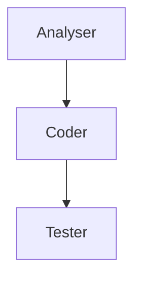
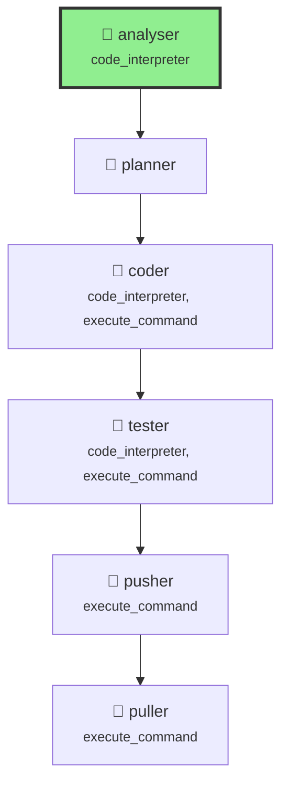

# Visualização de Workflows

Este documento descreve as ferramentas disponíveis para visualizar e construir workflows de forma visual.

## 🎨 Ferramentas Disponíveis

### 1. Endpoint de Visualização da API

A API inclui um endpoint dedicado para gerar diagramas Mermaid a partir de definições de workflow:

**Endpoint:** `POST /workflow/viz`

**Request:**
```json
{
  "workflow": {
    "name": "development-pipeline",
    "executors": [
      {
        "type": "agent",
        "name": "analyser",
        "instructions": "...",
        "tools": ["code_interpreter"]
      },
      {
        "type": "agent",
        "name": "coder",
        "instructions": "...",
        "tools": ["code_interpreter", "execute_command"]
      }
    ],
    "edges": [
      {
        "from_executor": "analyser",
        "to_executor": "coder",
        "edge_type": "direct"
      }
    ],
    "start_executor": "analyser"
  }
}
```

**Response:**
```json
{
  "mermaid_diagram": "graph TD\n    analyser[\"🤖 analyser\"]\n    coder[\"🤖 coder\"]\n    analyser --> coder",
  "html_preview": "<!DOCTYPE html>..."
}
```

### 2. Extensões do VS Code

#### Mermaid Preview
- **Instalação:** `ext install bierner.markdown-mermaid`
- **Uso:** Crie um arquivo `.md` com blocos de código Mermaid
- **Visualização:** Abra o preview (Ctrl+Shift+V)

**Exemplo:**
````markdown

```mermaid
graph TD
    A[Analyser] --> B[Coder]
    B --> C[Tester]
```
````

#### JSON Flow
- **Instalação:** `ext install ManuelGil.json-flow`
- **Uso:** Visualiza estruturas JSON como grafos interativos
- **Features:** Exporta para PNG, SVG, JPG

#### JSON Crack
- **Instalação:** `ext install AykutSarac.jsoncrack-vscode`
- **Uso:** Visualiza arquivos JSON como grafos de nós
- **Features:** Interface leve e rápida

### 3. Ferramentas Online

#### Mermaid Live Editor
- **URL:** https://mermaid.live
- **Uso:** Cole o diagrama Mermaid e visualize instantaneamente
- **Features:** Exporta para PNG, SVG, PDF

#### Draw.io / diagrams.net
- **URL:** https://app.diagrams.net
- **Uso:** Editor visual drag-and-drop
- **Features:** Exporta para vários formatos, integração com GitHub

### 4. Ferramentas do Microsoft Agent Framework

#### Foundry Agent Service Visual Designer
- **Status:** Preview pública
- **Features:** Editor visual drag-and-drop, suporte YAML
- **Acesso:** Requer acesso ao Foundry Agent Service

#### DevUI (Developer UI)
- **Status:** Disponível no repositório do Agent Framework
- **Features:** Visualização interativa, debug, testes
- **Uso:** Para desenvolvimento e debugging

## 📝 Exemplos Práticos

### Exemplo 1: Gerar Diagrama via API

```bash
curl -X POST http://localhost:8000/workflow/viz \
  -H "Content-Type: application/json" \
  -d '{
    "workflow": {
      "name": "simple-pipeline",
      "executors": [
        {
          "type": "agent",
          "name": "analyzer",
          "tools": ["code_interpreter"]
        },
        {
          "type": "agent",
          "name": "formatter"
        }
      ],
      "edges": [
        {
          "from_executor": "analyzer",
          "to_executor": "formatter",
          "edge_type": "direct"
        }
      ],
      "start_executor": "analyzer"
    }
  }' | jq -r '.mermaid_diagram'
```

### Exemplo 2: Visualizar no VS Code

1. Gere o diagrama via API
2. Salve em um arquivo `.md`:

````markdown
# Workflow: Development Pipeline


```mermaid
graph TD
    analyser["🤖 analyser<br/><small>code_interpreter</small>"]
    planner["🤖 planner"]
    coder["🤖 coder<br/><small>code_interpreter, execute_command</small>"]
    tester["🤖 tester<br/><small>code_interpreter, execute_command</small>"]
    pusher["🤖 pusher<br/><small>execute_command</small>"]
    puller["🤖 puller<br/><small>execute_command</small>"]
    
    analyser --> planner
    planner --> coder
    coder --> tester
    tester --> pusher
    pusher --> puller
    
    style analyser fill:#90EE90,stroke:#333,stroke-width:3px
```
````

3. Abra o preview (Ctrl+Shift+V)

### Exemplo 3: Usar Mermaid Live Editor

1. Acesse https://mermaid.live
2. Cole o diagrama Mermaid gerado pela API
3. Visualize e exporte como PNG/SVG

### Exemplo 4: Criar Diagrama no Draw.io

1. Acesse https://app.diagrams.net
2. Crie um novo diagrama
3. Use a biblioteca de formas "Workflow" ou "Flowchart"
4. Desenhe o workflow visualmente
5. Exporte ou salve

## 🔧 Script Python para Gerar Diagramas

Você também pode usar o módulo Python diretamente:

```python
from src.tools.workflow_viz import workflow_json_to_mermaid

workflow_json = {
    "name": "my-workflow",
    "executors": [
        {
            "type": "agent",
            "name": "agent1",
            "tools": ["code_interpreter"]
        }
    ],
    "edges": [],
    "start_executor": "agent1"
}

mermaid = workflow_json_to_mermaid(workflow_json)
print(mermaid)
```

## 📊 Símbolos e Convenções

Os diagramas Mermaid gerados usam:

- 🤖 = Agente (Agent Executor)
- ⚙️ = Função (Function Executor)
- Verde = Executor inicial (start_executor)
- Seta sólida (-->) = Edge direto
- Seta tracejada (-.->) = Edge condicional
- Seta dupla (==>) = Fan-out/Fan-in

## 🚀 Recomendações

### Para Desenvolvimento Rápido
- Use o endpoint `/workflow/viz` da API
- Visualize no Mermaid Live Editor
- Ou use a extensão Mermaid Preview no VS Code

### Para Documentação
- Gere diagramas Mermaid
- Inclua em arquivos Markdown
- Renderiza automaticamente no GitHub/GitLab

### Para Edição Visual Completa
- Use Draw.io para criar workflows visualmente
- Depois converta para JSON manualmente
- Ou use Foundry Visual Designer (se tiver acesso)

### Para Debugging
- Use DevUI do Microsoft Agent Framework
- Visualize execuções em tempo real
- Rastreie mensagens entre executores

## 📚 Recursos Adicionais

- [Mermaid Documentation](https://mermaid.js.org/)
- [Microsoft Agent Framework Docs](https://learn.microsoft.com/en-us/agent-framework/)
- [Draw.io Documentation](https://www.diagrams.net/doc/)
- [VS Code Extensions Marketplace](https://marketplace.visualstudio.com/)
